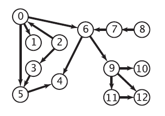

## 定义

拓扑排序的英文名是 Topological sorting。

拓扑排序要解决的问题是给一个图的所有节点排序。

我们可以拿大学选课的例子来描述这个过程，比如学习大学课程中有：单变量微积分，线性代数，离散数学概述，概率论与统计学概述，语言基础，算法导论，机器学习。当我们想要学习 算法导论 的时候，就必须先学会 离散数学概述 和 概率论与统计学概述，不然在课堂就会听的一脸懵逼。当然还有一个更加前的课程 单变量微积分。这些课程就相当于几个顶点 $u$ , 顶点之间的有向边 $(u,v)$ 就相当于学习课程的顺序。显然拓扑排序不是那么的麻烦，不然你是如何选出合适的学习顺序。下面将介绍如何将这个过程抽象出来，用算法来实现。

但是如果某一天排课的老师打瞌睡了，说想要学习 算法导论，还得先学 机器学习，而 机器学习 的前置课程又是 算法导论，然后你就一万脸懵逼了，我到底应该先学哪一个 ? 当然我们在这里不考虑什么同时学几个课程的情况。在这里，算法导论 和 机器学习 间就出现了一个环，显然你现在没办法弄清楚你需要学什么了，于是你也没办法进行拓扑排序了。因而如果有向图中存在环路，那么我们就没办法进行 拓扑排序 了。

因此我们可以说 在一个[DAG（有向无环图）](/graph/dag)中，我们间图中的顶点以线性方式进行排序，使得对于任何的顶点 $u$ 到 $v$ 的有向边 $(u,v)$ , 都可以有 $u$ 在 $v$ 的前面。

还有给定一个[DAG（有向无环图）](/graph/dag)，如果从 $i$ 到 $j$ 有边，则认为 $j$ 依赖于 $i$ 。如果 $i$ 到 $j$ 有路径（ $i$ 可达 $j$ ），则称 $j$ 间接依赖于 $i$ 。

拓扑排序的目标是将所有节点排序，使得排在前面的节点不能依赖于排在后面的节点。

## Kahn 算法

将入度为 0 的边组成一个集合 $S$

每次从 $S$ 里面取出一个顶点 $v$ （可以随便取）放入 $L$ , 然后遍历顶点 $v$ 的所有边 $(u_1, v), (u_2, v), (u_3, v) \cdots$ , 并删除，并判断如果该边的另一个顶点，如果在移除这一条边后入度为 0 , 那么就将这个顶点放入集合 $L$ 中。不断地重复取出顶点然后……

最后当集合为空后，就检查图中是否存在任何边。如果有，那么这个图一定有环路，否者返回 $L$ , $L$ 中顺序就是拓扑排序的结果

首先看来自[Wiki](https://en.wikipedia.org/wiki/Topological_sorting#Kahn's_algorithm)的伪代码

```text
L← Empty list that will contain the sorted elements
S ← Set of all nodes with no incoming edges
while S is non-empty do
    remove a node n from S
    insert n into L
    for each node m with an edge e from n to m do
        remove edge e from the graph
        if m has no other incoming edges then
            insert m into S
if graph has edges then
    return error (graph has at least onecycle)
else
    return L (a topologically sortedorder)
```

代码的核心是，是维持一个入度为 0 的顶点。

可以参考该图



对其排序的结果就是：2 -> 8 -> 0 -> 3 -> 7 -> 1 -> 5 -> 6 -> 9 -> 4 -> 11 -> 10 -> 12

### 时间复杂度

假设这个图 $G = (V, E)$ 在初始化入度为 0 的集合 $S$ 的时候就需要遍历整个图，并检查每一条边，因而有 $\mathcal{O}(E+V)$ 的复杂度。然后对该集合进行操作，显然也是需要 $\mathcal{O}(E+V)$ 的时间复杂度。

因而总的时间复杂度就有 $\mathcal{O}(E+V)$

### 实现

伪代码：

```text
bool toposort() {
	q = new queue();
	for (i = 0; i < n; i++)
		if (in_deg[i] == 0) q.push(i);
	ans = new vector();
	while (!q.empty()) {
		u = q.pop();
		ans.push_back(u);
		for each edge(u, v) {
			if (--in_deg[v] == 0) q.push(v);
		}
	}
	if (ans.size() == n) {
		for (i = 0; i < n; i++)
			std::cout << ans[i] << std::endl;
		return true;
	} else {
		return false;
	}
}
```

## DFS 算法

```c++
// dfs 版本
bool dfs(int u) {
  c[u] = -1;
  for (int v = 0; v <= n; v++)
    if (G[u][v]) {
      if (c[v] < 0)
        return false;
      else if (!c[v])
        dfs(v);
    }
  c[u] = 1;
  topo.push_back(u);
  return true;
}
bool toposort() {
  topo.clear();
  memset(c, 0, sizeof(c));
  for (int u = 0; u <= n; u++)
    if (!c[u])
      if (!dfs(u)) return false;
  reverse(topo.begin(), topo.end());
  return true;
}
```

时间复杂度： $O(n+m)$ 空间复杂度： $O(n)$

### 合理性证明

考虑一个图，删掉某个入度为 0 的节点之后，如果新图可以拓扑排序，那么原图一定也可以。反过来，如果原图可以拓扑排序，那么删掉后也可以。

### 应用

拓扑排序可以用来判断图中是否有环，

还可以用来判断图是否是一条链。

## 参考

1.  离散数学及其应用。ISBN:9787111555391
2.  <https://blog.csdn.net/dm_vincent/article/details/7714519>
3.  Topological sorting,<https://en.wikipedia.org/w/index.php?title=Topological_sorting&oldid=854351542>
